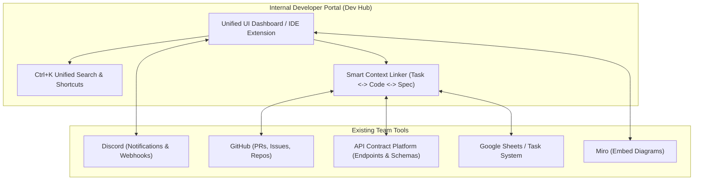

# 🚀 Project Summary: Internal Developer Portal (Dev Unified Workspace Hub)

## 📌 1. บทสรุปโปรเจกต์ (Project Overview)
**แนวคิดหลัก:** สร้างศูนย์กลางการทำงานของนักพัฒนา (**Internal Developer Portal / Dev Command Center**) ที่รวมข้อมูล หน้าจอ และ Workflow การทำงานจาก 6 เครื่องมือหลักที่ทีมใช้งานอยู่มาไว้ในจุดเดียว เพื่อแก้ปัญหา **Context Switching** และลด **Cognitive Load** ของทีมพัฒนา 

---

## 🛠️ 2. การแยกฟีเจอร์ตามเครื่องมือที่คุณใช้งาน (Feature Breakdown by Tool)

แยกรายละเอียดฟีเจอร์และระดับความเข้มข้นในการรวม (Integration Level) ตามทั้ง 6 แอปที่คุณใช้อยู่ดังนี้:

| เครื่องมือ | วัตถุประสงค์เดิมของคุณ | ฟีเจอร์ที่ควรรวมใน Platform ใหม่ | รูปแบบ Integration ที่แนะนำ |
| :--- | :--- | :--- | :--- |
| **1. Discord** | คุยและประชุมกับทีม | • Central Notification Stream (แจ้งเตือนเหตุการณ์สำคัญ)<br>• Discord Quick Launcher (ปุ่มกดเปิดห้อง Voice Call ใน Discord)<br>• Team Online Status Badge | **Lite / Webhook & Widget**<br>(ไม่ทำ Voice เอง ให้ส่ง Webhook และทำ Deep Link เปิด Discord) |
| **2. Google Sheets** | Track งานของแต่ละคน | • Personal Task List View (หน้าดูงานตัวเอง)<br>• Quick Status Update (อัปเดตสถานะ To-do / Doing / Done)<br>• Task Linker (ผูก ID งานเข้ากับ Git Branch/API) | **Medium / API Integration**<br>(ใช้ Google Sheets API ดึงข้อมูลและอัปเดตแบบ 2-way sync) |
| **3. Miro** | สร้าง Workflow Diagram | • Diagram Viewer Panel (หน้าจอฝัง ดูไดอะแกรม)<br>• Node-to-Code Mapping (คลิกกล่องใน Miro เพื่อเด้งไปดูไฟล์โค้ด/API endpoint) | **Lite / Embed SDK**<br>(ฝัง iFrame/Web SDK ดูได้อย่างเดียว ถ้าจะวาดเพิ่มค่อยกดเปิดแอป Miro) |
| **4. GitHub** | รวบรวมโค้ดและ Review | • PR & Issue Dashboard (ดู PR ที่รอเรา Review)<br>• Branch/Commit Activity Feed<br>• CI/CD Build Status Indicator | **Deep / GitHub REST & GraphQL API**<br>(ดึง Status, PRs, และ Issues มาจัดการได้โดยตรง) |
| **5. IDE** | เขียนโค้ด | • Platform Integration Sidebar (แผงข้างๆ ใน IDE)<br>• Code Anchor (ผูกบรรทัดโค้ดเข้ากับ API Contract / Task) | **Deep / VS Code Extension**<br>(ทำเป็นส่วนขยายบน IDE เพื่อให้ Dev ทำงานจากใน IDE ได้เลย) |
| **6. API Contract Platform** | กำหนดข้อตกลง API | • Interactive API Explorer / Documentation Viewer<br>• Mock Data Generator (กดลองยิง API Mockได้ในพอร์ทัล)<br>• Schema Drift Alert (เตือนถ้าโค้ดไม่ตรงกับ Spec) | **Deep / API Sync & Schema Parser**<br>(ดึง OpenAPI/Swagger หรือ Contract Schema มาแสดงผลแบบ Interactive) |

---

## 💻 3. ข้อกำหนดทางเทคโนโลยี (Tech Stack Architecture)

สถาปัตยกรรมระบบได้รับการออกแบบในรูปแบบ **Hybrid Architecture (Central Web Platform + Lightweight IDE Extension)** โดยแบ่งชั้นการทำงานดังนี้:

```
[ Frontend: Next.js Web Dashboard ] <----\
                                          +---> [ Backend API Gateway (Go) ] <---> [ PostgreSQL DB ]
[ IDE Client: VS Code Extension ]   <----/             |
                                                       +---> (Syncs 6 External Tools: GitHub, Sheet, Discord, Miro, API Spec)
```

### 🗄️ 3.1 Backend & Engine Layer (Platform Service)
* **Language:** **Go (Golang)** - *Industry Standard สำหรับ Platform Engineering*
* **Web Framework:** **Gin / Fiber** (เน้น High Performance REST APIs & Parallel Goroutines Fetching)
* **Database & ORM:** **PostgreSQL** + **GORM / Bun** (เก็บ User, Project Metadata & Mapping ลิงก์ระหว่าง Task <-> Code <-> API)
* **Background Scheduler / Sync Engine:** **Asynq / Go-Cron** (ดึงข้อมูลแบบ Cron Sync จาก Google Sheets & GitHub)
* **Auth & Security:** JWT / OAuth 2.0 (GitHub OAuth Integration)

### 🎨 3.2 Web Platform Layer (Central Dashboard)
* **Framework:** **Next.js 14+ (React / TypeScript)**
* **Styling & UI Components:** **Tailwind CSS** + **Shadcn UI** (การออกแบบเน้น Developer-centric ลุคพรีเมียมคุมโทน Dark Mode)
* **State & Data Fetching:** **TanStack Query (React Query)** (จัดการ Auto-refresh & Caching ข้อมูลจาก 6 APIs)

### 🔌 3.3 IDE Client Layer (Developer Touchpoint)
* **Framework:** **VS Code Extension API (TypeScript)**
* **UI Interface:** VS Code Webview API (ฝัง React Mini-Dashboard ใน Sidebar ของ IDE)

### 🐳 3.4 Containerization & Local Infrastructure (Docker)
* **Application Containerization:** **Docker & Multi-stage Builds**
  * **Go Backend:** คอมไพล์เป็น Scratch/Alpine Binary ขนาดเล็กมาก (ไม่กี่ MB) และรันได้เสถียร
  * **Next.js Frontend:** รันบน Node.js Standalone Container
* **Local Development Environment:** **Docker Compose**
  * สำหรับสั่ง Spin up บริการทั้งหมดขึ้นมาพร้อมกันด้วยสั่งเดียว (`docker compose up`) ประกอบด้วย:
    1. `backend`: Go API Server
    2. `frontend`: Next.js Web App
    3. `postgres`: PostgreSQL Database
    4. `redis`: Redis (สำหรับการทำ Caching & Background Task Queue ของ Go)

### 🔗 3.5 Third-Party Integrations & SDKs
1. **GitHub:** GitHub GraphQL API & REST API (`google/go-github` หรือ Octokit)
2. **Google Sheets:** Google Sheets API v4 (`google-api-go-client`)
3. **Discord:** Discord Webhooks & Discord REST API
4. **Miro:** Miro Web SDK v2 (Read-only Diagram Embed)
5. **API Contract:** OpenAPI 3.0 Parser / Swagger Specs

---

## ⚖️ 4. สิ่งที่ "ควรรวม" vs "ยังไม่ควรรวม" (Scope & Priorities)

### ✅ สิ่งที่ "ควรรวมเป็นอันดับแรก" (Phase 1 MVP)
1. **GitHub + API Contract + Sheet Task (The Core Triad):** รวมการดู Task, ตรวจสอบ API Spec และสถานะ Code/PR ไว้ในที่เดียว
2. **Global Search (Ctrl+K):** ช่องค้นหาเดียวที่ค้นหาได้ทั้งชื่อ Task, ชื่อ API Endpoint, และ Repository ใน GitHub

### ⚠️ สิ่งที่ "ทำเป็นแค่จุดเชื่อมต่อ" (Don't Re-invent)
1. **Discord Voice Call:** ใช้ระบบคอลของ Discord ตามเดิม แต่ทำปุ่มกดเด้งไป Discord
2. **Miro Canvas Editor:** ไม่ต้องสร้างเครื่องมือวาดไดอะแกรมใหม่ ให้ฝังแบบ Read-only สำหรับอ้างอิง

---

## 🗺️ 5. สถาปัตยกรรมและแผนการพัฒนา (Suggested Architecture & Roadmap)



### 🎯 Phase 1: MVP (Minimum Viable Product)
* ทำ **Single Dashboard Page / Extension** ดึงข้อมูล **API Contract + GitHub PRs/Issues + Google Sheet Tasks** มาแสดงในหน้าเดียวกัน
* เพิ่ม **Unified Search (Ctrl+K)** ค้นหา API Spec หรือ Task ได้จากจุดเดียว

### 🚀 Phase 2: Context Linking & Embeds
* เชื่อมโยง Task เข้ากับ API Endpoint และ Git Branch
* ฝัง (Embed) Miro Diagram แบบ Read-only สำหรับ Architecture Preview

### 🔥 Phase 3: Automation & Discord Integration
* ส่งการแจ้งเตือนจาก Hub ไปยัง Discord Webhook
* ทำ Automation เช่น "เมื่อเปลี่ยนสถานะ Task ใน Hub ให้ อัปเดต Google Sheet และแจ้ง Discord ทันที"

---

## 💡 สรุปสิ่งที่ได้จากโปรเจกต์นี้
* ได้สร้างผลงานตรงสาย **Platform Engineering / DX (Developer Experience)**
* ได้ฝึกแก้ปัญหาจริงในทีม ลดเวลาการสลับแอป (Context Switching)
* ได้ฝึกทักษะการทำ **API Integration / Dashboard Orchestration**
